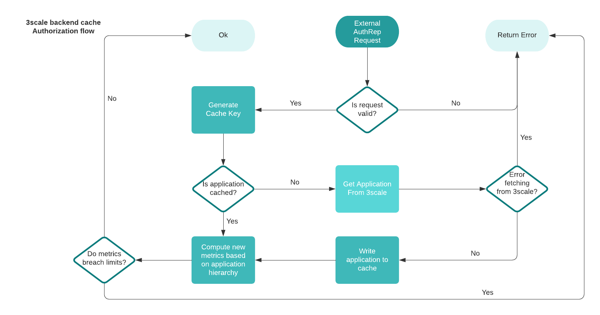
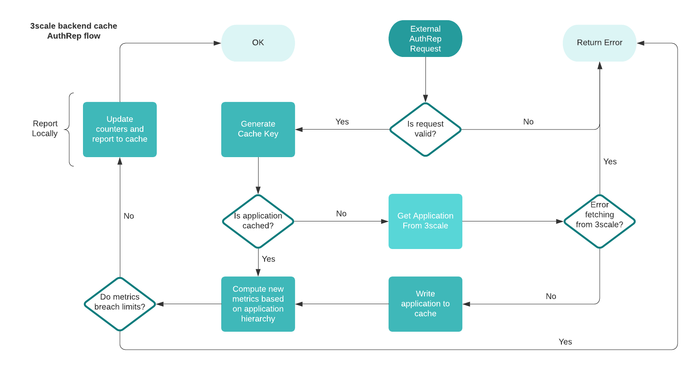
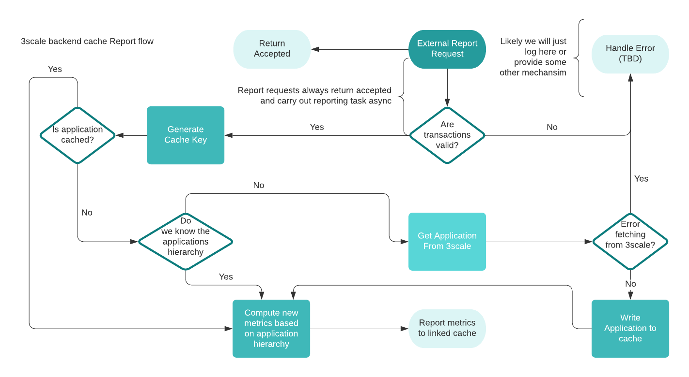
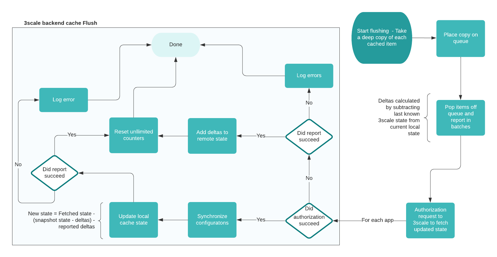

# 3scale Backend Cache

This document briefly explains the functionality offered by the `Backend` construct in this library.

## Usage

`Backend` provides an implementation of the [3scale client interface](https://github.com/3scale/3scale-go-client/blob/v0.4.0/threescale/client.go#L8-L21)
and so can be used as a drop in replacement for [3scale-go-client](https://github.com/3scale/3scale-go-client)
anywhere in which out of the box caching is desired between a gateway and Apisonator.

## Data Storage

Currently, the `Backend` supports and ships with an in-memory hash map data storage solution, however it has been left
open to extension, and is pluggable to custom storage implementations.

## Internals

The cache stores an `Application`, which is a local representation of a model in 3scale itself.
It is stored under a key which is generated from a combination of the models service identifier and application identifier.

An Application houses the following:

- `LimitCounter` - A counter which tracks rate limited metrics - this maps a metric onto a map of supported time periods,
which in turn map to a limit (the counter itself) which has a current and max value (integers). It manages a view
of local state, which incoming requests get recorded to in each iteration. It also holds a view of the last known state in 3scale.

- `UnlimitedCounter` - A counter which tracks metrics with no rate limits attached. It simply maps the metric name to an integer.

An `Application` is capable of holding both read and write locks, allowing it to block where appropriate.

## Functionality

### Supported Endpoints

`Backend` support Authorize, AuthRep and Report functionality. In each case, if the service is unknown to the cache,
it makes a request to the remote 3scale instance to fetch state. Requests that fail or otherwise error, will not have
their details added to the cache at that time.

#### Authorization

The following diagram describes the Authorization flow, where the incoming request metrics evaluates against the cache
to determine if rate limits have been breached, before being authorized or denied.

#### AuthRep

The following diagram describes the AuthRep flow, where the incoming request metrics evaluates against the cache
to determine if rate limits have been breached, before being authorized or denied. If authorized, metrics get written
to the cache.

#### Report

The following diagram describes the Report flow, where the incoming request metrics are written to the cache.

### Flushing

`Backend` exposes a `Flush` function which takes the data in the cache and reports it to 3scale.

The flushing process begins by adding a copy of all cached applications to a queue.
Applications get popped off the queue and grouped into related services before being reported in batches.
Metrics that get reported are discovered by subtracting the current value in the counter from the last know remote
state for the lowest known time period. Regular calls to flush will help increase accuracy when multiple gateways are
reporting due to the synchronization that occurs.

Reports use a timestamp derived from the usage reports fetched from 3scale. This enables the cache to become aware when
time periods have elapsed and therefore improve the accuracy of the reported stats.

After the report takes place, and a small time-period has elapsed to allow Apisonator to process the request,
synchronization occurs between the cache and 3scale to fetch updated state. There are four possible outcomes to consider
when dealing with the latest state:

1. Report failed and fetch state failed - Results in zero changes to cache state.
2. Report failed and fetch state succeeded:
    1. Check if any metrics and/or limits have been added/removed and adjust local state accordingly
    2. Set the new timestamp derived from the latest state
    3. Set the new counter values taking into account the failed report to be reported next iteration as well
       as requests that have been handled since the application's copy.
3. Report succeeded and fetch state failed:
    1. No changes occur to the local counter but local view of remote state increments to include the reported metrics.
    2. Unlimited metrics counter is reset
4. Report succeeded and fetch state succeeded:
    1. Check if any metrics and/or limits have been added/removed and adjust local state accordingly
    2. Unlimited metrics counter is reset
    3. Set the new timestamp derived from the latest state
    4. Set the new counter values taking into account requests that have been handled since the application's copy. 

#### Flushing Usage

It is expected to run the flushing process periodically at specified intervals (recommended every ~15seconds), however this
is left entirely to the caller to handle.

### Failure Policies

`Backend` supports accepting/denying requests in cases where 3scale is unreachable. This is achieved by injecting
`type FailurePolicy func() bool` when creating a new `Backend`. `FailurePolicy` will be called where the following predicates are true:

1. The error is a network error
2. The error is a timeout or temporary

The default policy is to reject all requests when upstream is unreachable.